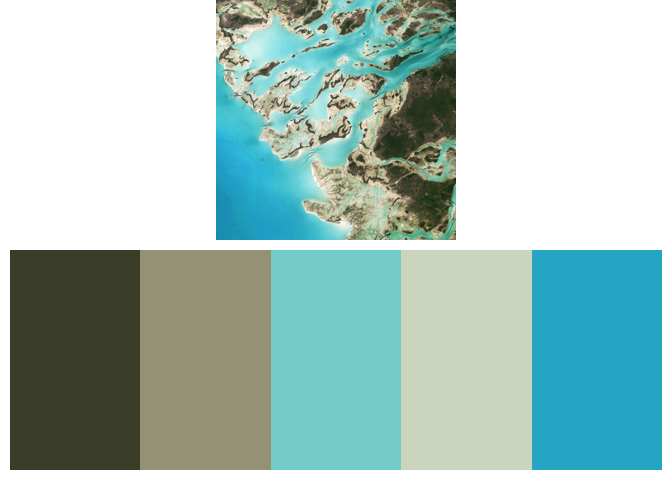

<!-- README.md is generated from README.Rmd. Please edit this file directly. -->

[](https://cran.r-project.org/package=earthtones)
[](https://app.codecov.io/gh/traitecoevo/earthtones?branch=master)
[](https://github.com/traitecoevo/earthtones/actions/workflows/R-CMD-check.yaml)

## Overview

**earthtones** is an R package designed to extract color palettes from
satellite imagery, providing visually appealing earth-inspired color
schemes.

## Installation

Install the released version from CRAN:

``` r
#install.packages("earthtones")
```

Or the latest development version from GitHub:

``` r
#remotes::install_github("wcornwell/earthtones")
```

Load the package:

``` r
library("earthtones")
```

## Usage

`earthtones` provides the function `get_earthtones`, which:

1.  Downloads satellite imagery from a supported provider (e.g., Esri).
2.  Converts image colors into a perceptually uniform color space ([CIE
    LAB](https://en.wikipedia.org/wiki/Lab_color_space)).
3.  Identifies dominant colors using clustering methods (`kmeans` or
    `pam`).
4.  Returns an aesthetically pleasing color palette.

### Example: Grand Canyon

``` r
get_earthtones(latitude = 36.094994, longitude = -111.837962, 
               zoom = 12, number_of_colors = 8)
```

<!-- -->

Adjust `number_of_colors` to control how many dominant colors are
returned. The `zoom` parameter controls the level of detail, with larger
numbers providing closer views.

### Example: The Bahamas

Explore vibrant tropical colors:

``` r
get_earthtones(latitude = 24.2, longitude = -77.88, zoom = 11, number_of_colors = 5)
```

<!-- -->

### Example: Uluru, Australia

Earth tones from the iconic Australian landscape:

``` r
get_earthtones(latitude = -25.33, longitude = 131.0396, zoom = 10, number_of_colors = 6)
```

<!-- -->

## Using Palettes in Your Own Visualizations

To retrieve the color palette without plotting the map, set
`include.map = FALSE`:

``` r
palette <- get_earthtones(latitude = 24.2, longitude = -77.88,
                          zoom = 11, number_of_colors = 5,
                          include.map = FALSE)

print(palette)
#> [1] "#4A4E35" "#A5A188" "#84D4D3" "#D3DCC9" "#29B3CF"
```

This returns a standard R color palette ready to be used directly in
your visualizations or designs.

### Example with ggplot2

Here’s how you might apply the palette to a `ggplot2` visualization:

``` r
library(ggplot2)

# Generate the palette
bahamas_palette <- get_earthtones(latitude = 24.2, longitude = -77.88,
                                  zoom = 11, number_of_colors = 5,
                                  include.map = FALSE)

# Example ggplot
ggplot(mtcars, aes(factor(cyl), fill = factor(cyl))) +
  geom_bar() +
  scale_fill_manual(values = bahamas_palette) +
  theme_minimal() +
  labs(title = "MTCARS Cylinders with Bahamas Earthtones",
       fill = "Cylinders")
```

<!-- -->
